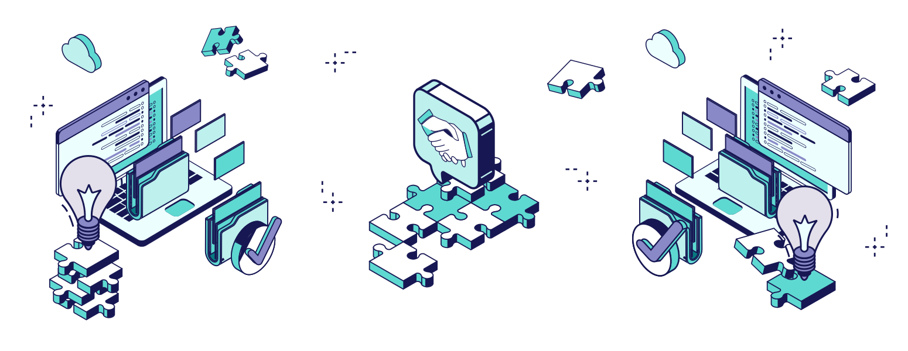

**Get Compute** is the starting point for compute buyers eager to run tasks on the Koii network. Use the information below to determine if Koii is the **right fit for your computational needs.**

## Performance Metrics

| **Aspect** | **Details**                                                                                                      | **Metric**                                                                                                             |
|------------|------------------------------------------------------------------------------------------------------------------|-------------------------------------------------------------------------------------------------------------------------------------|
| **Latency**    | Latency levels are on par with leading cloud VM instances.                                                 | **Typically 20-30ms latency.**                                        |
| **Cost**       | During our testnet phase, costs are provisional as $KOII is not monetized.                              | **75% savings compared to AWS.**            |
| **Speed**      | Tasks can be simultaneously processed by hundreds to thousands of compute nodes. | **With appropriate incentives, Koii can exceed AWS in speed.** |
| **Uptime**     | Benefit from the resilience of a decentralized network — it's almost always operational.                   | **Always online, any downtime is communicated in advance.**    |

## Potential Use Cases

| Category                      | Use Cases                                          |
|------------------------------|----------------------------------------------------|
| **General Computing**        | Data Analytics, Batch Processing, Simulation      |
| **Machine Learning/AI**      | Model Training, Model Inference, NLP              |
| **Rendering & Graphics**     | 3D Rendering, Video Processing, Image Processing  |
| **Web & App Development**    | Web Hosting, Backend APIs, Database Management    |
| **Blockchain & Cryptocurrency** | Smart Contract Execution, DeFi, Tokenization    |
| **Scientific Research**      | Genomic Analysis, Clinical Trials, Drug Research  |
| **Security**                 | Decryption, Fraud Detection, Threat Analysis      |
| **Game Development**         | Multiplayer Hosting, Game Testing, Live Streaming |
| **Internet of Things (IoT)** | IoT Data Processing, Security Management, Smart Grid Management |
| **Content Creation & Management** | Content Distribution, Digital Right Management, Content Moderation |
| **E-commerce & Business**    | Supply Chain, CRM, Inventory Management           |

## Supported Technology

At Koii, we recognize the rapid evolution of technology, especially in the computational domain. Our network seamlessly integrates with popular technologies, ensuring compute buyers have access to familiar tools. Explore in-depth how Koii supports:

- **Docker Images (coming soon):** Harness the power of containerization. Create, deploy, and run your tasks using Docker to ensure consistency across the network.

- **CUDA:** Accelerate your tasks by leveraging CUDA, a parallel computing platform and API model created by Nvidia. Ideal for compute-intensive workloads, especially in domains like AI and graphics.

- **PyTorch:** Whether you're into machine learning, deep learning, or AI, our support for PyTorch ensures you can build and train your models on the Koii efficiently.

To delve deeper into how these technologies seamlessly integrate with Koii, [read more here](/compute/supported).

## Developer API

At the heart of Koii's developer toolkit is our [Developer API](/compute/developerapi), designed to streamline and elevate the experience of task creators. With this API, developers can swiftly determine the average Koii incentive necessary to guarantee task completion, gain real-time insights into node availability, and which of those nodes meet their task requirements.

## FAQ

For anything else please refer to our [Frequently Asked Questions (FAQ) page](/compute/FAQ) for anything else regarding task distribution, handling of requests, and much more.
