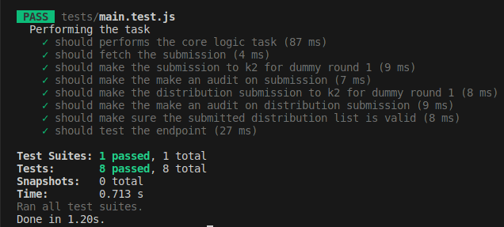

import ContentLink from "@site/src/components/contentLink";

# Testing Locally Using Jest


We provide a testing suite that makes task development very seamless and straightforward. We chose to use Jest in order to provide all the required task development resources in a consistent and isolated environment.

## What is Jest?

Jest is a popular JavaScript testing framework developed by Facebook. It provides a simple API for structuring tests and comes with all the functionality you need to write unit tests, perform snapshot testing, and create mocks.

Jest is designed to work with any JavaScript codebase, so you can use it to test your task based on Node.js. Jest tests are quick to write, easy to understand, and can be executed in any JavaScript environment.

For more information, please check [Jest's official website](https://jestjs.io/).

## How to use Jest?

If your task is cloned from our [K2 Task Template](/develop/write-a-koii-task/task-development-guide/k2-task-template/), you can directly run:

```bash
npm install
npm run webpack
npm run test
```

or

```bash
npm install
npm run webpack
npm test
```

It will start testing your task with Jest. The steps are:

- executeTask() => This is your main task function.
- submitPayload() => This is the function that fetches and makes the submission with dummy round 1.
- auditTask() => This is the function that fetches submission and audit data. Then return the vote result.
- submitDistributionList() => If the vote is true, this function uses dummyTaskData to simulate the distribution list.
- Available of your endpoints.

It will check that your task should:

- Performs the core logic task
- Fetch the submission
- Make submission to k2 for dummy round 1
- Make an audit of the submission
- Make the distribution submission to k2 for dummy round 1
- Make the make an audit on distribution submission
- Make sure the submitted distribution list is valid
- Test the endpoint

Your task should pass all the tests. If not, please check the error message and fix it. The task that passes the jest test looks like this:



## How to configure your test?

To configure your test, check the `/tests` folder and modify the `main.test.js` file. For more information, please check:

<ContentLink title="Test Configuration" link="/develop/write-a-koii-task/task-development-kit-tdk/testing-locally-with-docker/configuration" iconType="copy"/>

## How to test the task with my own data?

To use your data or run each step separately, please check:

<ContentLink title="Using UnitTest" link="/develop/write-a-koii-task/task-development-kit-tdk/testing-locally-with-docker/configuration" iconType="copy"/>
