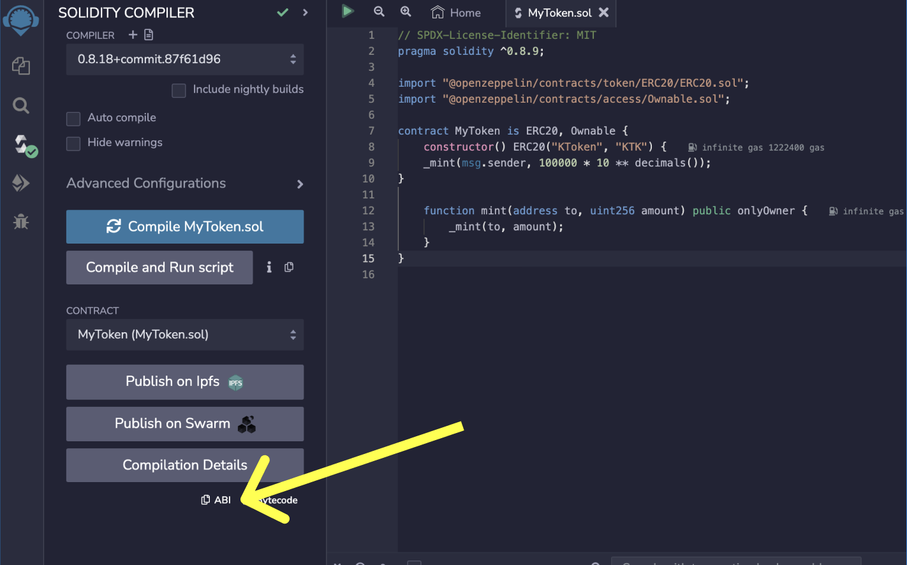

The Koii task will transfer a specific amount of tokens (10 KTokens) to the node runner's Ethereum address using the KToken smart contract. The core logic will involve creating a transaction, signing it, and sending it to the network. If the transaction is successful, the hash of the transaction will be returned.


# Getting Started

**1. Clone the Task Template Repository** 

Begin by cloning the [Task Template](https://github.com/koii-network/task-template) repository. Once cloned, navigate to the repository directory and execute the following commands to install the required dependencies:

```bash
yarn
yarn add web3
```

**2. Set Environment Variables**

Create a `.env` file in the root of the repository and populate it with the following environment variables and their respective values:

```
# Your Infura ID
INFURA_ID = ""

# The contract address of the deployed token
TOKEN_CONTRACT_ADDRESS = ""

# The address (public key) of the Ethereum address that deployed the contract
CONTRACT_OWNER_ADDRESS = ""

# The private key of the Ethereum address that deployed the contract
PRIVATE_KEY = ""

# The Ethereum address of the node runner that will execute the task
# Leave this blank; it will be injected before a node runner runs the task
RECIPIENT_ADDRESS = ""
```
**3. Add Contract ABI**

Create a new file named `KToken.json` in the root directory of the project. Copy and paste the contract's ABI (Application Binary Interface) into this file. You can obtain the ABI by following the arrow in the image below:




**4. Update Dependency Imports**

Navigate to the `task/submission.js` file, and update the dependency imports as follows:

```js title="/task/submission.js"
require('dotenv').config();
const { namespaceWrapper } = require('../_koiiNode/koiiNode');
const { Web3 } = require('web3');
const tokenContractABI = require('../KToken.json');
const web3 = new Web3(`https://goerli.infura.io/v3/${process.env.INFURA_ID}`);
const tokenContractAddress = process.env.TOKEN_CONTRACT_ADDRESS;
const privateKey = process.env.PRIVATE_KEY;
const userAddress = process.env.RECIPIENT_ADDRESS;
```

**5. Task Main Logic**

Still in `task/submission.js` file, replace the default `task()` method with the code below:

```js title="/task/submission.js"
  async task(round) {
    try {
      // Create an instance of the token contract using its ABI and contract address.
      const tokenContract = new web3.eth.Contract(
        tokenContractABI,
        tokenContractAddress,
      );

      const gasPrice = await web3.eth.getGasPrice();
      const rewardAmount = '10000000000000000000'; // 10 KTokens

      // Generate transaction data to call the "transfer" method of the token contract.
      const txData = tokenContract.methods
        .transfer(userAddress, rewardAmount)
        .encodeABI();

      // Get the current nonce (transaction count) for the contract owner's address.
      const nonce = await web3.eth.getTransactionCount(
        process.env.CONTRACT_OWNER_ADDRESS,
        'latest',
      );

      const tx = {
        nonce: nonce,
        gasPrice: gasPrice,
        gasLimit: web3.utils.toHex(300000),
        to: tokenContractAddress,
        data: txData,
      };

      // Sign the transaction using the contract owner's private key
      const signedTx = await web3.eth.accounts.signTransaction(tx, privateKey);
      const txReceipt = await web3.eth.sendSignedTransaction(
        signedTx.rawTransaction,
      ); // Send the signed transaction to the Ethereum network
      
      if (txReceipt.transactionHash) {
        // store value on NeDB
        await namespaceWrapper.storeSet('value', txReceipt.transactionHash);
      }
      return txReceipt.transactionHash;
    } catch (err) {
      console.log('ERROR IN EXECUTING TASK', err);
      return 'ERROR IN EXECUTING TASK' + err;
    }
```

Let's break down the code's functionality:

   - An instance of the token contract is created using its ABI (Application Binary Interface) and address.
   - The current gas price is fetched from the Ethereum network using `web3.eth.getGasPrice()`.
   - A reward amount of **10 KTokens** is defined.
   - Encoded data for the `transfer` method of the token contract is generated using `.encodeABI()`.
   - The current nonce (transaction count) of the contract owner's address is fetched using `web3.eth.getTransactionCount()`.
   - A transaction object (`tx`) is created with details like nonce, gas price, gas limit, target address (`to`), and data.
   - The transaction is signed using the contract owner's private key.
   - The signed transaction is sent to the Ethereum network using `web3.eth.sendSignedTransaction()`.
   - If the transaction is successful (i.e., `txReceipt.transactionHash` is available), the transaction hash is stored using the `namespaceWrapper.storeSet()` method.
