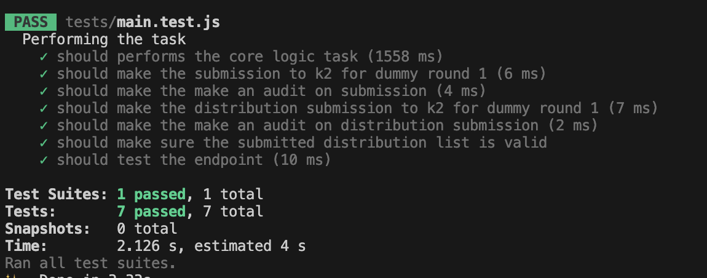

# Migrating from a Node.js App to a Koii Task: Transforming a Web Scraper

This guide walks you through the conversion of a basic Node.js web scraper into a Koii Task, outlining the necessary steps to achieve this migration.

# Getting Started

The application being converted into a Koii Task is a web scraper that retrieves the latest news headlines from the [CoinMarketCap](https://coinmarketcap.com/headlines/news) website.

Below is the existing code for the web scraper. Within the `fetchLatestNews` function, an HTTP GET request is initiated using the `axios` library. The `cheerio` library is utilized to load, parse HTML content, and select elements with specific classes. The `.each` function iterates through selected elements to extract news titles and URLs.

```js
// Dependencies
const axios = require("axios");
const express = require("express");
const cheerio = require("cheerio");
const PORT = 8000;
const app = express();

// URL to scrape
const URL = "https://coinmarketcap.com/headlines/news";

// Fetch latest news headlines
async function fetchLatestNews() {
  try {
    const response = await axios(URL);
    const html = response.data;
    const $ = cheerio.load(html);

    const latestNews = [];
    $(`.uikit-row .uikit-col-sm-10 .cmc-link`, html).each(function () {
      const title = $(this).text();
      const url = $(this).attr("href");
      latestNews.push({
        title,
        url,
      });
    });
    console.log("LATEST NEWS FETCHED", latestNews);
    return latestNews;
  } catch (error) {
    console.log(error);
  }
}

fetchLatestNews();
```

## Converting to a Koii Task

Follow these steps to convert the Node.js application into a Koii Task:

1. Clone the [Task Template](https://github.com/koii-network/task-template) repository and execute `yarn` to install dependencies.

2. Navigate to the `task/submission.js` file, where the core logic of the task exists. Replace the default `task()` method with the code block below:

  ```js title="/task/submission.js"
  // Existing code...
    async task(round) {
      try {
        const URL = 'https://coinmarketcap.com/headlines/news';
        const latestNews = [];
        const response = await axios(URL);
        const html = response.data;
        const $ = cheerio.load(html);

        $(`.uikit-row .uikit-col-sm-10 .cmc-link`, html).each(function () {
          const title = $(this).text();
          const url = $(this).attr('href');
          latestNews.push({
            title,
            url,
          });
        });

        if (latestNews !== null && latestNews.length !== 0) {
          // Store value on NeDB
          await namespaceWrapper.storeSet('value', JSON.stringify(latestNews));
          console.log('LATEST NEWS FETCHED', latestNews);
        }
        return JSON.stringify(latestNews);
      } catch (err) {
        console.log('ERROR IN EXECUTING TASK', err);
        return 'ERROR IN EXECUTING TASK' + err;
      }
    }
  // Existing code...
  ```

  In this code block, the web scraper logic remains intact. However, the submission process now involves sending a stringified version of `latestNews` to K2 (Koii Settlement Layer) as proof of the executed task.

3. Update the audit logic in the `task/audit.js` file to suit the web scraper's behavior. Inside the `validateNode()` method, modify the audit condition as shown:

  ```js title="/task/audit.js"
  // Existing code...
  if (JSON.parse(submission_value) !== null && JSON.parse(submission_value).length !== 0) {
    // For a successful audit, return true (indicating the audited node submission is correct)
    vote = true;
  } else {
  // Existing code...
  ```

  The validation checks whether the parsed object (`submission_value`) is not null and the length is not zero. Depending on this validation outcome, the `vote` variable is set to **`true`** or **`false`**, indicating the accuracy of the audited node's submission.

4. Finally, validate the Koii Task by executing `yarn test`. Successful validation will yield output similar to the one illustrated below:

  

Congratulations on the successfully converting a Node.js application into a Koii Task!

For access to the source code of both the original Node.js application and the converted Koii Task, refer to the [GitHub repository](https://github.com/Giftea/web-scraper).
